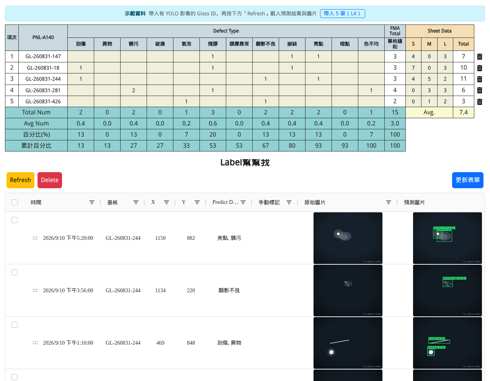
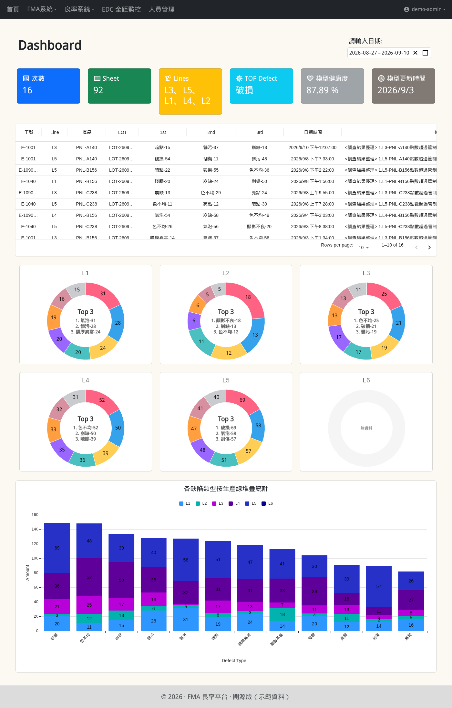
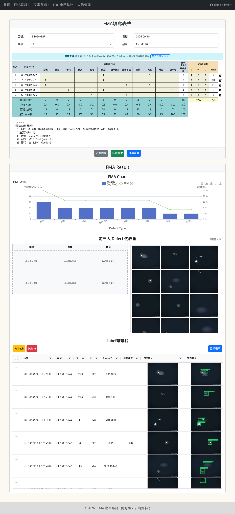
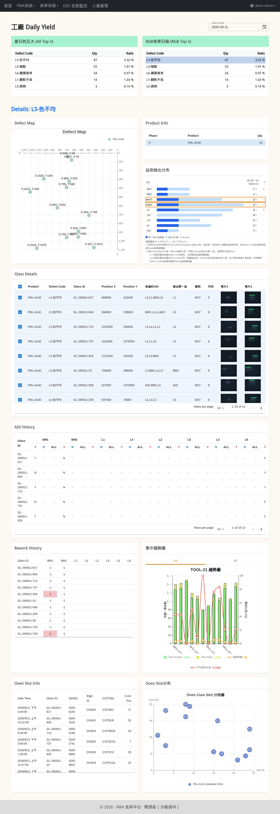
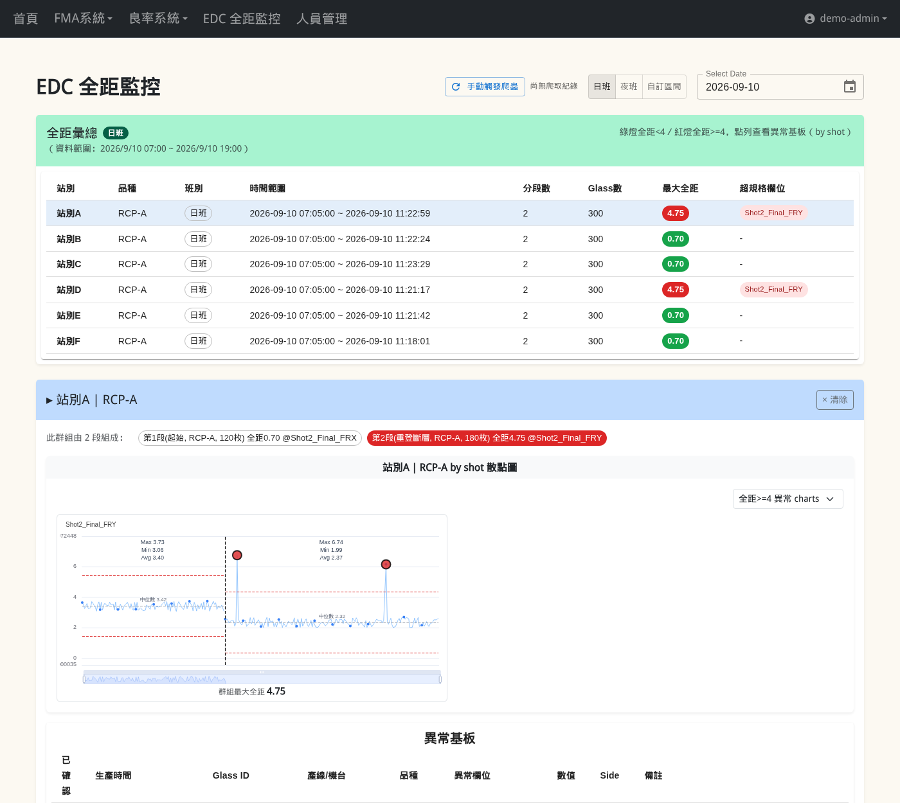
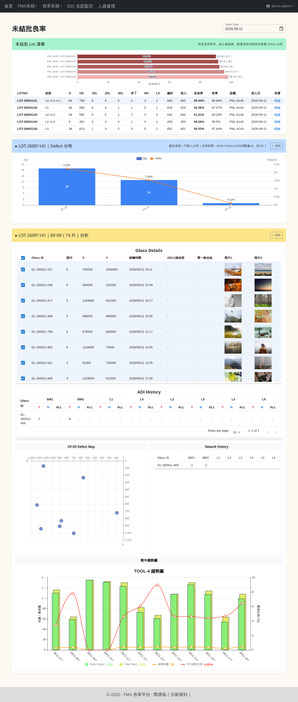
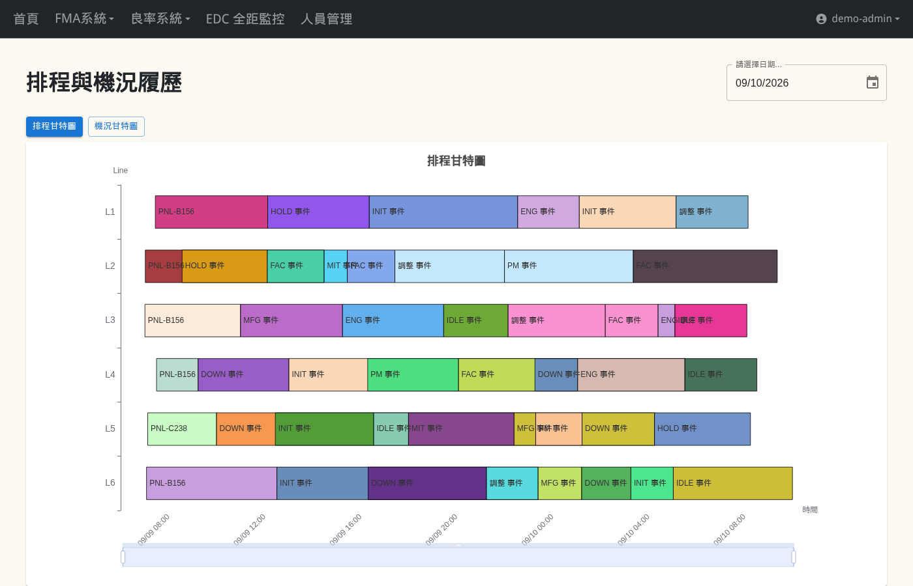
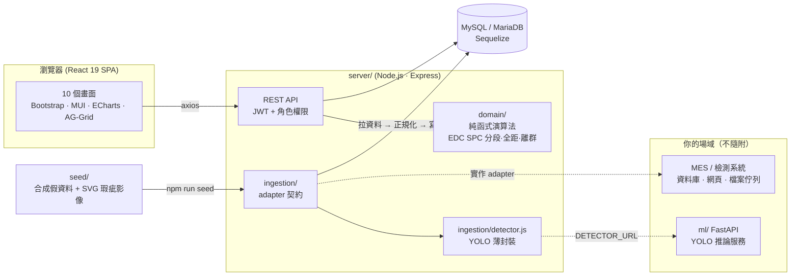

# FMA 良率平台（開源版）

**Factory Yield Analytics & Defect Recognition Platform — open-source edition**

[](https://github.com/DeeyoTsai/factory-yield-analytics/actions/workflows/deidentify-gate.yml)
[](server/package.json)
[](LICENSE)

[概覽](#概覽) • [畫面走訪](#畫面走訪) • [架構](#架構) • [快速開始](#快速開始) • [接自己的資料流](#接自己的資料流) • [專案結構](#專案結構)



一套我獨力開發、在面板廠實際上線的良率分析系統的**去識別化、可運作**開源版本。
整合人工缺陷登錄（FMA）、良率／缺陷資料的三層鑽取、EDC 對位全距 SPC 監控、
排程與機況甘特圖，以及 **YOLO 電腦視覺自動判缺陷並預填 FMA 表格**。

A de-identified, **runnable** open-source edition of a factory yield-analytics system I built
solo and deployed on a panel production line: manual defect logging (FMA), drill-down yield /
defect analytics, EDC alignment-range SPC monitoring, schedule / machine-status Gantt charts,
and a **YOLO vision pipeline that classifies defect images and pre-fills the FMA table**.

> [!IMPORTANT]
> **所有資料皆為假資料。** 產線、站別、機台、產品型號、缺陷分類、glass id、員工工號、影像——
> 全部由 `npm run seed` 合成，不含任何真實生產資訊。對外資料交換（FTP／網頁爬蟲）不隨附實作，
> 改由可插拔的 **ingestion adapter** 串接——clone 下來接自己的資料流就能用。
>
> **All data is fabricated.** Lines, stations, machines, products, defect taxonomy, glass ids,
> employee ids and images are synthesized by `npm run seed`. External data exchange (FTP /
> crawlers) is intentionally not included; plug in your own data via the ingestion adapter.

## 概覽

產線每天產出大量檢測資料：AOI 檢出的缺陷座標與照片、曝光機的對位量測、設備狀態事件、
每批 lot 的良率。這套系統把它們收進一個 MySQL，提供五組畫面：

| 畫面 | 解決的問題 |
|---|---|
| **FMA 填表 × YOLO** | 品保人員人工登錄缺陷時，YOLO 已先把每片 glass 的檢測影像判好類別、自動填進表格；人工複判結果回寫，成為下一輪訓練資料 |
| **Daily Yield 三層鑽取** | 當日前五大缺陷 → 哪些 glass → 每片的檢出站別、履歷、趨勢，不用切換系統一路查到底 |
| **未結批良率** | 還在製程中的 lot 也能看良率與缺陷分布，不必等結批 |
| **EDC 對位全距 SPC** | 取代 Excel VBA 巨集：自動分段、算全距、挑離群兇手，避免基準線位移造成假告警 |
| **排程與機況甘特圖** | 每條產線的排程與設備事件一眼看完 |

技術棧：React 19 · Node.js / Express · Sequelize（MySQL / MariaDB）· ECharts · MUI · AG-Grid · Python FastAPI（optional）

## 畫面走訪

### 首頁 Dashboard

近兩週的 FMA 登錄次數、檢查片數、TOP 缺陷、YOLO 模型健康度（人工複判與模型不一致的比例）；
下方是每筆登錄的前三大缺陷，以及各產線的缺陷分布圓餅與 12 類缺陷 × 6 條產線的堆疊長條。



### FMA 填表 × YOLO 自動預填

這是本專案的核心整合點。輸入 glass id 按 **Refresh**：

1. 後端撈出這批 glass 的 YOLO 檢測影像與 `pred_result`
2. 每張影像的第一筆 detection 依 `config/defectTypes.js` 的 `yolo → key` 對照，
   **自動填進 FMA 表格對應的缺陷欄**（該列使用者已手填的不覆蓋）
3. Sheet data（S/M/L 顆數）同步帶入；表尾 Total / Avg / 百分比 / 累計百分比即時重算
4. **前三大 Defect 代表圖**：從影像庫拖拉代表圖到對應缺陷欄，隨表單存檔
5. **Label 幫幫我**（AG-Grid）：原圖／預測圖（含 bbox）並排，可人工複判、改標、拖曳排序——
   複判結果回寫 DB

<details>
<summary>完整頁面截圖</summary>



</details>

### Daily Yield 三層鑽取

當日前五大缺陷 → 點一筆展開 Defect Map（缺陷在基板上的座標分布）、Glass Details（每片 glass 的
X/Y、檢出站別、缺陷照片）、站別檢出分布、ADI / Rework 履歷、集中趨勢圖（產出／投入／異常率雙軸）、
Oven Slot 分布。



### EDC 對位全距 SPC 監控

曝光機每片 glass 的對位量測（每 shot 四角點 8 欄）。純函式的 SPC 演算法：

- **自動分段**：品種變更為硬邊界；「多分鐘間隔 **且** 滾動中位數位移」才判定為重登斷層
  （純 idle 不切、純雜訊不切），避免基準線位移造成假全距告警
- **段內全距** ≥ 4 標紅，**離群兇手**以中位數為中心（非平均）挑出，且必須真的超出管制線
- 第 2 層 by-shot 散點圖：每段各自的中位線、段界黑虛線、離群點紅色置頂、dataZoom 縮放



### 未結批良率三層鑽取

還在製程中的 lot 也能看良率與缺陷分布，不必等結批。Lot 清單（依全良率排序的長條 + 明細表）
→ 點一個 lot 看 Defect 分布（藍色長條 = 達門檻可再鑽入）→ 點一根長條展開該 defect 的
Glass Details、ADI / Rework 履歷、Defect Map、集中趨勢圖。



### 排程與機況甘特圖

每條產線的排程與設備事件（DOWN / PM / HOLD / 調整…）畫成甘特圖，底部可拖拉縮放時間軸。



## 架構



| 層 | 內容 |
|---|---|
| **前端** `client/` | React 19 + React Router 7，Context API 管狀態（Auth / FMA / Dashboard）。圖表用 ECharts 與 MUI X Charts，表格用 AG-Grid 與 MUI DataGrid |
| **後端** `server/` | Express + Sequelize。JWT 驗證、依工號自動推導部門與權限層級。`domain/` 是**無 IO 的純函式**（EDC 分段／全距／離群、班別窗口推算），有單元測試 |
| **資料匯入** `server/ingestion/` | `adapter.js` 定義契約；內建 `seedAdapter.js` 產生合成資料。接自己的資料流＝實作一個同契約的模組，見 [`docs/ingestion.md`](docs/ingestion.md) |
| **YOLO** `server/ingestion/detector.js` + `ml/` | server 端薄封裝：設 `DETECTOR_URL` 就 POST 影像到推論服務，沒設用內建 mock。`ml/` 是 FastAPI 骨架（mock detector，換成真 YOLOv10 只要改一個函式） |
| **Seed** `server/seed/` | 合成 15 個工作日的 Daily Yield / 未結批 / EDC / 機況 / FMA 資料，並**就地畫出 SVG 瑕疵影像**（12 類各有畫法，預測圖 bbox 與 `pred_result` JSON 一致）——零外部依賴、離線可跑 |

### 缺陷分類：單一事實來源

`server/config/defectTypes.js`（前端有同步副本）定義 12 類缺陷的 `key`（DB 欄位）／`label`（顯示）／
`code`／`yolo`（模型 class 名）。FMA 表格欄位、統計、YOLO 對照、seed 全部由它產生——
換成自己場域的分類只要改這一張表。

## 快速開始

### 需求

- Node.js ≥ 18
- MySQL 8 或 MariaDB 10+，並先建好一個空資料庫（預設名 `fma_yield`）
- Python 3.10+（**選用**，只有要跑真 YOLO 推論服務才需要）

### 安裝與啟動

```bash
git clone https://github.com/DeeyoTsai/factory-yield-analytics.git
cd factory-yield-analytics

# 後端：設定 + 建表 + 灌假資料
cd server
cp .env.example .env          # 填 DB_USER / DB_PASSWORD
npm install
npm run seed
npm run dev                   # http://localhost:8080

# 前端（另開終端機）
cd client
npm install
npm start                     # http://localhost:3000
```

> [!WARNING]
> `npm run seed` 會 **DROP 並重建所有資料表**（含使用者），然後灌入 15 個工作日的合成資料並在
> `client/media/demo-defects/` 畫出瑕疵影像。這是 demo 用的重置指令——接了自己的資料流之後不要再跑。

> [!TIP]
> 正式部署時 `cd client && npm run build`，server 會直接提供 `client/build/` 的靜態檔，
> 前後端合併在同一個 port，不需要另外處理 CORS。

### Demo 帳號

密碼一律 `demo1234`。登入頁也有「以 Demo 帳號登入」按鈕。

| 工號 | 角色 |
|---|---|
| `E-1001` | 一般使用者（ENG） |
| `E-1040` | 一般使用者（MFG） |
| `E-1090MGR` | 管理員 |

> [!NOTE]
> FMA 填表頁上方有「示範資料」列，一鍵帶入有 YOLO 影像的 glass id，再按 Refresh 就能看到自動預填。
> 這條提示列是 demo 專用——接自己的資料流時把 `GET /api/imgtable/demoGlasses` 刪掉，前端會自動不顯示。

## 接自己的資料流

這個版本刻意**不附任何對外爬蟲或 FTP client**——不同場域的來源系統差太多。你需要做的：

1. **實作一個 ingestion adapter**（`server/ingestion/adapter.js` 的契約：`run(opts) → IngestionResult`），
   從你的來源拉資料、正規化成 model 欄位、呼叫既有的寫入層。三種常見 pattern
   （直連來源 DB／網頁爬蟲／檔案或訊息佇列）與範例見 [`docs/ingestion.md`](docs/ingestion.md)
2. **YOLO**：把 `ml/app.py` 的 `get_detector()` 換成載入你權重的實作，`server/.env` 設
   `DETECTOR_URL`。`pred_result` 契約：`{ "detections": [ { "class", "confidence", "bbox" } ] }`
3. **缺陷分類**：改 `config/defectTypes.js`（兩份）+ `ml/classes.json`，重跑 seed
4. **站別／產線名稱**：`server/config/stations.js`（前端有副本）

EDC 的 SPC 演算法（`server/domain/edcAnalysis.js` 的 `analyzeEdcData(rows)`）是純函式：
把你的逐片量測列丟進去就得到分段與離群結果，不用重寫。

## Roadmap

私有版有、開源版**刻意未搬**的功能。原版資料流是抓來源系統現成的圖表 script 與網頁，
開源版若要做，會改成「結構化數據進 DB → domain 層彙總 → API 出圖」的方式重新設計：

- **ADI hourly defect 分析**：每小時／每站的缺陷數趨勢
- **OverShoot 爆點基板明細**：超規缺陷的 glass 清單與缺陷圖
- **多 phase 趨勢圖**：同一缺陷在 phase 1／2 兩條線都出現時，各查一條趨勢（目前 seed 只產生單 phase）
- 個人頁（使用者自己的 FMA 紀錄）

## 專案結構

```
client/src/
  components/            畫面元件（FMA 表單、Dashboard、yield-system/ 三層鑽取、edc/）
  contexts/              AuthContext · FmaContext · DashboardContext
  config/defectTypes.js  缺陷分類（與 server 同步）
server/
  routes/ controllers/   REST API
  models/                Sequelize models（22 張表）
  domain/                純函式演算法 + 測試（edcAnalysis · edcShift · edcStore · unfinishStore）
  ingestion/             adapter 契約 · seedAdapter · detector（YOLO 薄封裝）
  seed/                  合成資料 · SVG 瑕疵影像產生器
  config/defectTypes.js  缺陷分類單一事實來源
ml/                      FastAPI YOLO 推論骨架（optional）
docs/ingestion.md        資料匯入指南
scripts/deidentify-gate.sh  去識別化結構型 gate（CI 執行）
```

### 測試

```bash
cd server && npm run test:domain    # EDC 分段 / 離群 / 班別窗口，25 項（node:test，無額外依賴）
cd client && npm test               # 前端純函式（defectImgSrc · stationProfile）
```
